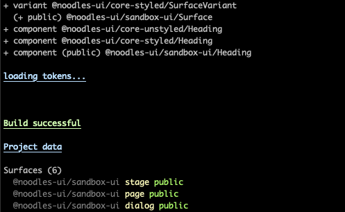

# Noodles UI / Sandbox UI

> Noodles UI experimenation sandbox library

Early days. See [root README](../../../README.md) for an introduction.

## Developing

**Note:** see [@noodles-ui/lib-tools](../../support/lib-tools/README.md) for more on `xxx:nui` commands.

Run all dev tasks in parallel

```bash
npm run dev
```



Or independently

```bash
npm run dev:nui   # generate code
npm run dev:test  # tests
npm run dev:lib   # build library
```

To inspect loaded resources, generated project data, and errors you can expand details with the `--expand` argument.

You can expand resources and build artefacts

- by matching all or part of its **name**
- by **type** (one of `surface`, `theme`, `variant`, `component`, `mixin`)
- by matching all or part of its **module**'s name (when pattern starts with `@`).

Examples (by name, by type, by module):

```bash
npm run build:nui -- --expand Heading
npm run build:test -- --expand theme
npm run build:lib -- --expand @core-styled
```

You can also expand details of build errors caught when linting generated files:

```bash
npm run build:nui -- --expand eslint
```

You can combine more than one pattern:

```bash
npm run build:nui -- --expand @core-styled --expand Heading
```

Note: results in union filter
TODO intersection filter

## Building

All build tasks in sequence:

- Generate code
- Run tests
- Build the library

```bash
npm run build:nui
```

## License

Copyright (c) 2024 [Andre Torgal](https://andretorgal.com/).

Published under a [MIT License](https://andrezero.mit-license.org/2024).
